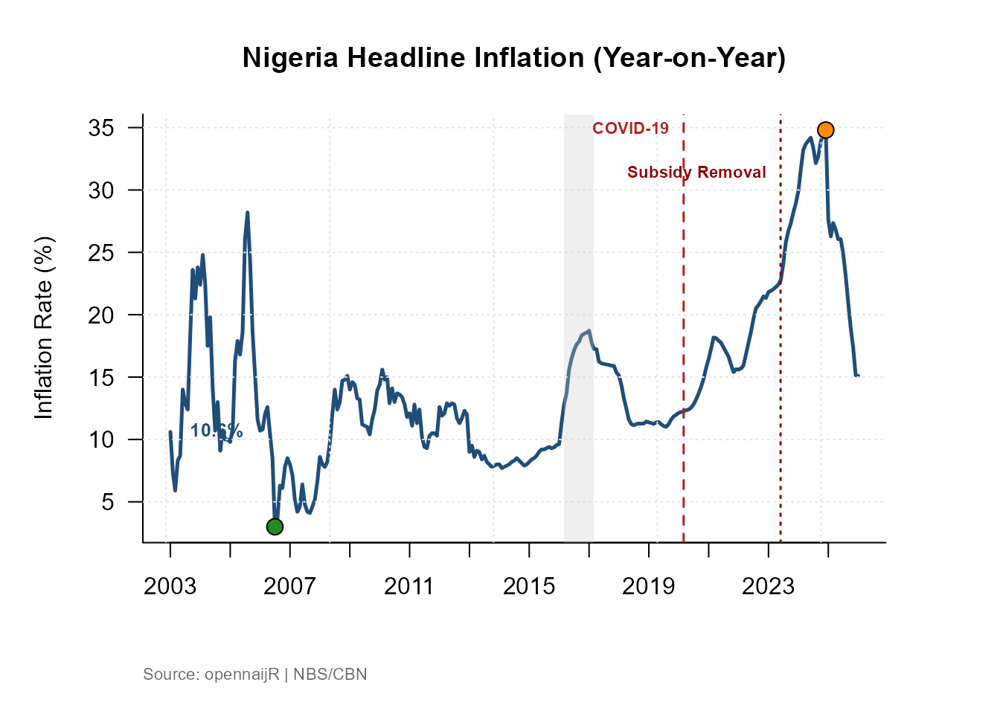
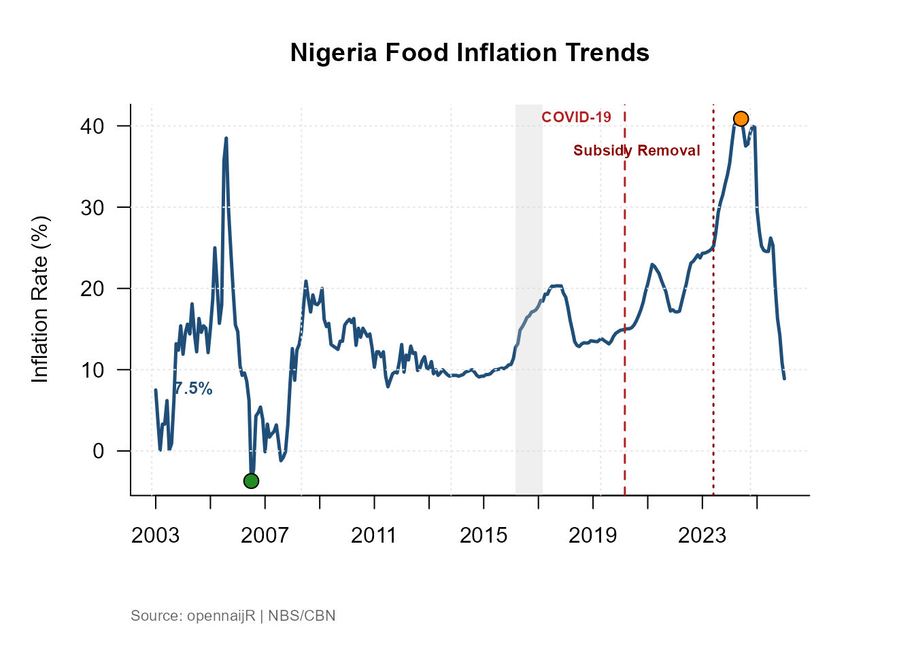
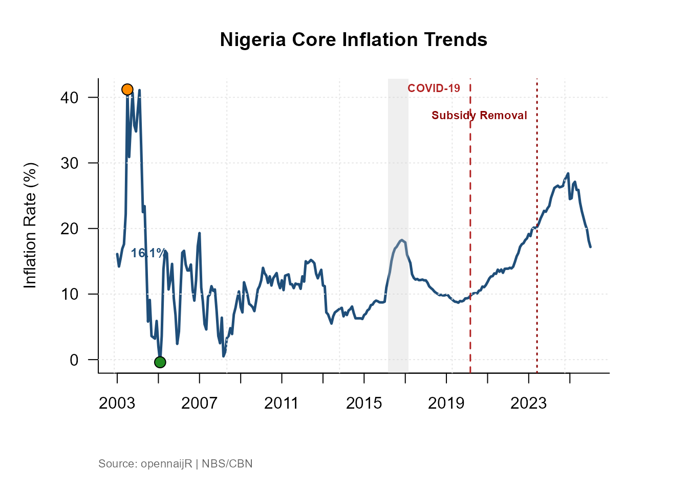
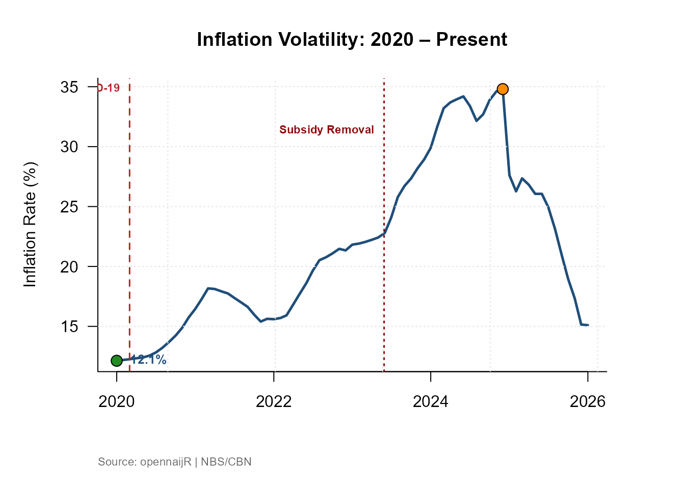
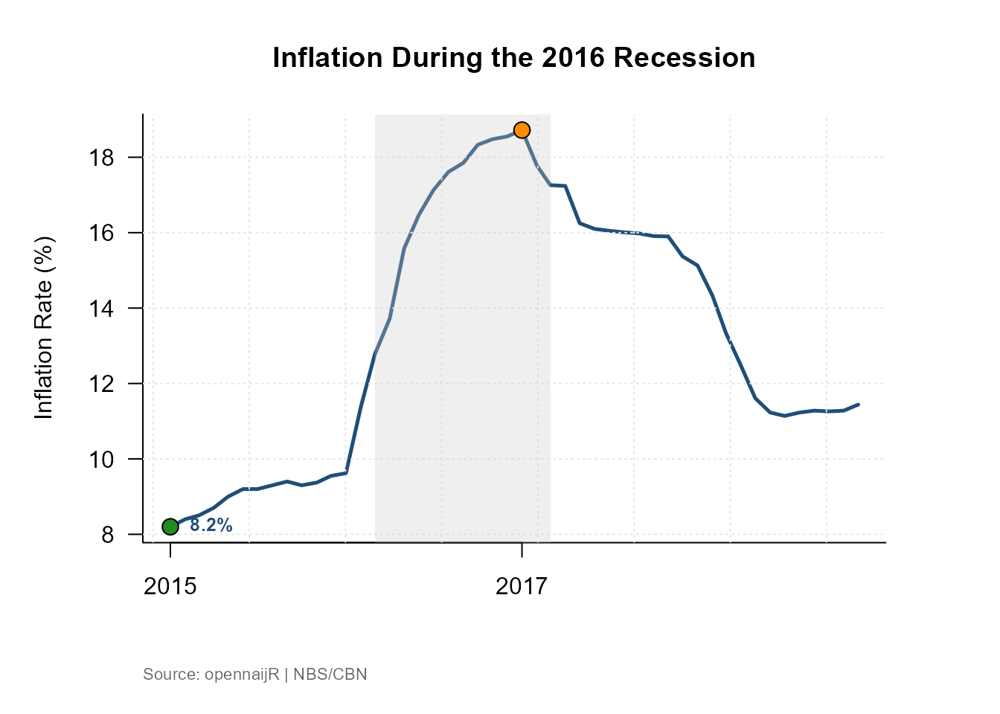
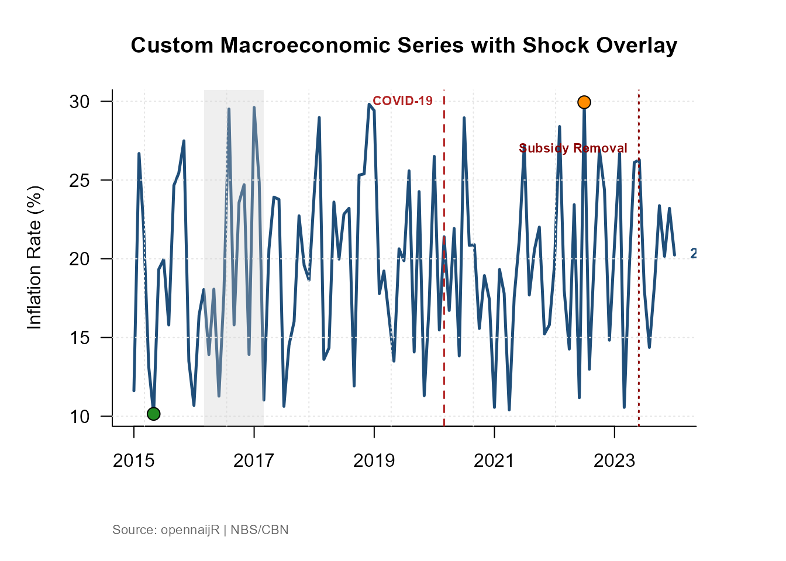
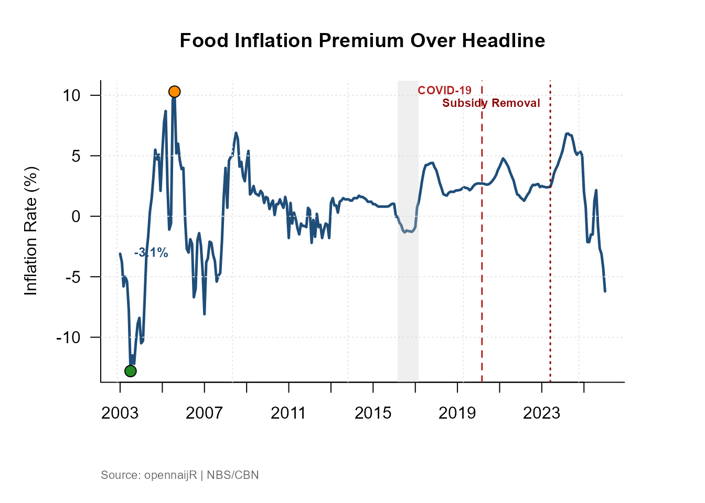
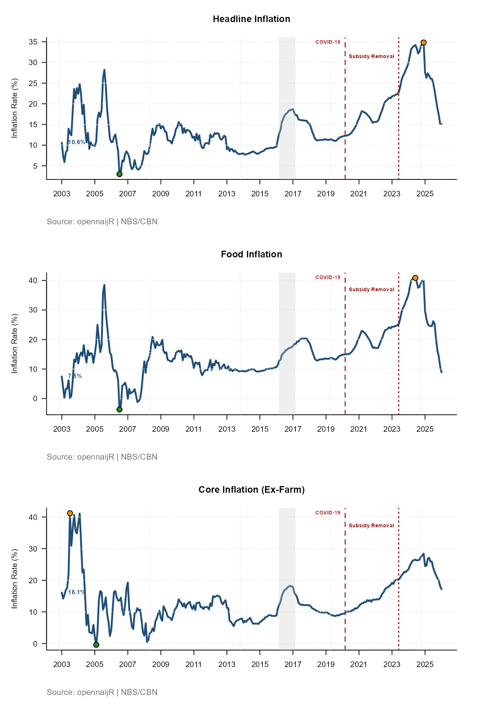

# Visualising Inflation with plot_inflation_shocks()

## What is `plot_inflation_shocks()`?

Inflation numbers in isolation are only half the story. To understand
*why* a rate moved, you need the economic context around it — when did a
recession hit? When did fuel subsidies end? When did COVID disrupt
supply chains?

[`plot_inflation_shocks()`](https://laws2020.github.io/opennaijR/reference/plot_inflation_shocks.md)
answers that need. It draws an inflation time series and automatically
overlays vertical markers for significant Nigerian macroeconomic events,
so the relationship between policy shocks and price movements is
immediately visible — no manual annotation required.

------------------------------------------------------------------------

## Arguments

| Argument | Type | Default | What it does |
|----|----|----|----|
| `data` | `data.frame` | — | Your dataset. Must contain a date column and a numeric value column |
| `date_col` | `character` | `"date"` | Name of the column holding dates |
| `val_col` | `character` | `"headline_yoy"` | Name of the column to plot on the y-axis |
| `title` | `character` | `"Nigeria Inflation Trends"` | Plot title |

**Output:** A rendered plot in your active graphics device. The shock
markers are drawn automatically — you do not configure them.

------------------------------------------------------------------------

## Built-in Shock Events

The function ships with markers for the following events. They are drawn
as labelled vertical lines so you can immediately see where each shock
falls on your series.

| Event                     | Period                     |
|---------------------------|----------------------------|
| 2016 Recession            | Q1–Q4 2016                 |
| COVID-19 Pandemic         | March 2020 – December 2021 |
| 2023 Fuel Subsidy Removal | June 2023                  |

These represent structural breaks in the Nigerian economy that
consistently appear in macroeconomic research. When your inflation
series shows a sharp inflection, the markers tell you whether a known
shock coincides with it.

------------------------------------------------------------------------

## 1. Basic Usage

If your dataset comes from `cbn("inflation")`, the default column names
already match the function’s expectations. One line produces a
publication-quality chart.

``` r
library(opennaijR)

infl <- cbn("inflation")
#> 📦 Loading cached CBN data from pins

plot_inflation_shocks(infl)
```



**What you will see:** Headline year-on-year inflation plotted as a
continuous line, with vertical bands or lines marking the three shock
events, a labelled y-axis showing percentage points, and a clean title.

------------------------------------------------------------------------

## 2. Switching Inflation Measures

Nigeria’s headline inflation figure is a weighted composite. Sometimes
you need to look beneath it. Use the `val_col` argument to plot a
different component and update the title to match.

``` r
# Food inflation — typically more volatile than headline
plot_inflation_shocks(
  data    = infl,
  val_col = "food_yoy",
  title   = "Nigeria Food Inflation Trends"
)
```



``` r
# Core inflation — strips out farm produce and energy
plot_inflation_shocks(
  data    = infl,
  val_col = "core_ex_farm_yoy",
  title   = "Nigeria Core Inflation Trends"
)
```



**When to use each:**

- `headline_yoy` — overall price level; use for general briefings and
  policy summaries.
- `food_yoy` — most sensitive to supply shocks, weather, and import
  costs; use when analysing food security or agricultural policy.
- `core_ex_farm_yoy` — strips out food and energy to reveal underlying
  demand pressures; preferred in monetary policy analysis.

Comparing all three against the same shock markers reveals whether a
price spike was broad-based or driven by a single component.

------------------------------------------------------------------------

## 3. Focusing on a Specific Period

The full inflation series stretches back many years. For a presentation
or report focused on recent volatility, filter your data frame before
passing it to the function. The shock markers will automatically adjust
to whichever events fall inside the filtered window.

``` r
# Zoom in on the post-COVID and subsidy-removal period
recent <- infl[infl$date >= as.Date("2020-01-01"), ]

plot_inflation_shocks(
  data  = recent,
  title = "Inflation Volatility: 2020 – Present"
)
```



``` r
# Isolate the 2016 recession era
recession_era <- infl[
  infl$date >= as.Date("2015-01-01") &
  infl$date <= as.Date("2018-12-01"), 
]

plot_inflation_shocks(
  data  = recession_era,
  title = "Inflation During the 2016 Recession"
)
```



**Why filter rather than zoom the axis?** Filtering restricts the data
that enters the function, which keeps the y-axis scale honest for the
period of interest. Axis zooming can visually exaggerate variation by
compressing a small range.

------------------------------------------------------------------------

## 4. Working with External or Custom Data

[`plot_inflation_shocks()`](https://laws2020.github.io/opennaijR/reference/plot_inflation_shocks.md)
is not limited to CBN data. Any data frame with a date column and a
numeric column works — as long as you tell the function which column is
which via `date_col` and `val_col`.

``` r
# A data frame with non-standard column names
external_df <- data.frame(
  period = seq(as.Date("2015-01-01"), as.Date("2024-01-01"), by = "month"),
  rate   = runif(109, 10, 30)
)

plot_inflation_shocks(
  data     = external_df,
  date_col = "period",
  val_col  = "rate",
  title    = "Custom Macroeconomic Series with Shock Overlay"
)
```



This makes the function reusable for NBS data, World Bank series, or any
other monthly indicator you want to plot in the Nigerian macroeconomic
context.

------------------------------------------------------------------------

## 5. Deriving a Measure First, then Plotting

[`plot_inflation_shocks()`](https://laws2020.github.io/opennaijR/reference/plot_inflation_shocks.md)
integrates naturally with
[`derive_measure()`](https://laws2020.github.io/opennaijR/reference/derive_measure.md).
Engineer a feature and plot it immediately — the result is a new column
in the same data frame, so no extra steps are needed.

``` r
# Derive the food-headline gap, then visualise it
infl_gap <- derive_measure(
  infl,
  food_gap = food_yoy - headline_yoy,
  reason   = "Food premium over headline inflation"
)

plot_inflation_shocks(
  data    = infl_gap,
  val_col = "food_gap",
  title   = "Food Inflation Premium Over Headline"
)
```



A positive `food_gap` means food prices are rising faster than the
overall basket — a signal of food-specific supply pressure rather than
broad demand inflation.

------------------------------------------------------------------------

## 6. Batch Comparison: Multiple Metrics in One View

`par(mfrow)` stacks multiple plots in a single graphics window. This is
the fastest way to compare how different inflation components responded
to the same shock.

``` r
metrics <- c(
  "headline_yoy",
  "food_yoy",
  "core_ex_farm_yoy"
)

labels <- c(
  "Headline Inflation",
  "Food Inflation",
  "Core Inflation (Ex-Farm)"
)

par(mfrow = c(3, 1), mar = c(4, 4, 3, 1))

for (i in seq_along(metrics)) {
  plot_inflation_shocks(
    data    = infl,
    val_col = metrics[i],
    title   = labels[i]
  )
}
```



``` r

# Reset graphics layout after use
par(mfrow = c(1, 1))
```

**Reading the stacked output:** Look at how the shock markers align — or
misalign — across the three panels. If food inflation spikes sharply at
the 2023 subsidy removal but core inflation barely moves, it tells you
the shock was a supply-side, cost-push event rather than a demand-driven
one. That is a meaningful policy finding.

------------------------------------------------------------------------

## 7. Saving Plots for Reports

To export a chart for a policy brief or journal submission, wrap the
function in [`png()`](https://rdrr.io/r/grDevices/png.html) or
[`pdf()`](https://rdrr.io/r/grDevices/pdf.html):

``` r
png(
  filename = "nigeria_headline_inflation.png",
  width    = 2400,
  height   = 1500,
  res      = 300
)

plot_inflation_shocks(
  data  = infl,
  title = "Nigeria Headline Inflation with Macroeconomic Shocks"
)

dev.off()
```

For PDF output, replace [`png()`](https://rdrr.io/r/grDevices/png.html)
with `pdf(file = "...", width = 8, height = 5)`. PDF is preferred for
academic submissions because it is vector-based and scales without loss
of quality.

------------------------------------------------------------------------

## Workflow Position

[`plot_inflation_shocks()`](https://laws2020.github.io/opennaijR/reference/plot_inflation_shocks.md)
sits at the *end* of the opennaijR pipeline, after your data is clean
and your features are derived:

    cbn()  →  apply_projection()  →  derive_measure()  →  plot_inflation_shocks()

It is a communication tool — it turns an analysis-ready dataset into
something a policymaker, student, or journalist can read at a glance.
